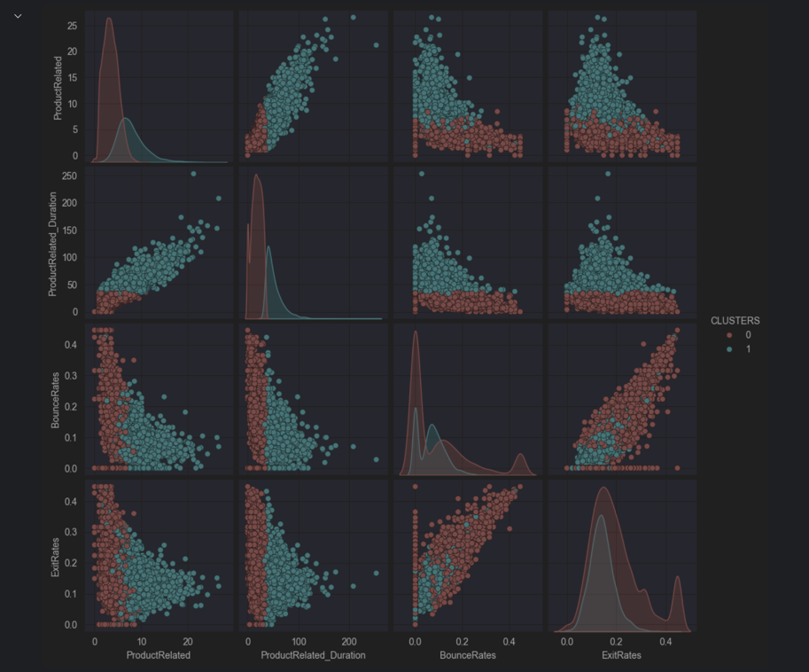

# Customer Online Shopping Behaviour - Clustering with K-Means

This notebook explores an e-commerce session dataset to identify patterns in customer behaviour using clustering.

## Objectives
- Prepare and clean the dataset
- Apply K-Means clustering
- Evaluate the quality of the clustering solution
- Analyse behavioural differences between identified clusters

**Libraries required:** pandas, numpy, matplotlib, seaborn, scikit-learn, scipy

## Problem Statement
E-commerce platforms generate large amounts of session data, but translating this into actionable insights can be challenging. Visitors often behave differently: some browse product pages extensively while others leave quickly without engaging. Identifying these behavioural patterns is essential for improving website design, tailoring marketing strategies, and increasing conversion rates.

The aim of this project was to use clustering to segment online shoppers into meaningful groups based on browsing behaviour, allowing businesses to understand their customers better and design interventions that improve engagement.

---

## Dataset
The dataset used contains approximately 12,000 records of individual shopping sessions from an online retail store. Each observation describes a visitor’s interaction with the site, including metrics such as:  

- **ProductRelated_Duration** – time spent on product-related pages  
- **BounceRates** – proportion of visitors who leave the site after viewing only one page  
- **ExitRates** – likelihood of a visitor exiting from a particular page  
- **Revenue** – indicator of whether the session led to a purchase  

Initial inspection revealed some invalid values, such as negative durations, which were cleaned during preprocessing.

---
### Data Plot [process and insights below]

### Data Preparation
- Removed 33 observations containing negative values in `ProductRelated_Duration`  
- Standardised features to ensure that different scales did not bias the clustering process  
- Focused on behavioural features most relevant to session quality (e.g., product-related time, bounce rates, exit rates)  

### Model Choice
The **K-Means algorithm** was selected for clustering. The choice was guided by:  
- **Scalability:** Efficient with ~12,000 rows, striking a balance between data size and computational cost  
- **Interpretability:** Produces clear cluster centroids, easy to explain in business terms  
- **Suitability:** Well-suited for identifying broad patterns of user behaviour in medium-sized datasets  

While alternatives like DBSCAN and hierarchical clustering were considered, they were either too sensitive to parameterisation or computationally heavier for this dataset.

### Cluster Selection
The optimal number of clusters was determined using:  
- **Elbow Method** – examining the point of diminishing returns in inertia  
- **Silhouette Analysis** – measuring the separation between clusters  

Both methods indicated that **two clusters** provided the most meaningful segmentation.

---

## Analysis of Data
Two distinct clusters emerged from the analysis:

### Cluster 0 (Quick Visitors)
- Accounts for **~8,535 sessions**  
- Shorter product-related durations (around 18 seconds on average)  
- Higher bounce and exit rates  
- Indicates low engagement and a tendency to leave before meaningful interaction  

### Cluster 1 (Engaged Visitors)
- Accounts for **~3,748 sessions**  
- Longer product-related durations (around 52 seconds on average)  
- Lower bounce and exit rates  
- Reflects visitors with higher engagement and greater potential for conversion  

The distribution of time spent on product pages differed significantly between the clusters. Cluster 1 showed a wider spread, indicating diverse browsing patterns within this group. Cluster 0 was more concentrated, with most visitors spending little time before leaving.

---

## Analysis of Model Behaviour
The clustering solution was assessed in terms of size, variance, and separation:

- **Cluster Balance:** Cluster 0 was larger, reflecting the reality that a majority of sessions are short-lived. Cluster 1, though smaller, is valuable because it represents more engaged visitors  
- **Variance:** Cluster 1 exhibited higher internal variability, showing that while the average behaviour is well captured, individuals within this cluster still display diverse levels of engagement  
- **Separation:** The distance between cluster centroids confirmed meaningful differentiation. Silhouette scores supported the conclusion that the clusters were well-separated and reliable  

Overall, the model effectively captured two distinct behavioural profiles: disengaged visitors and engaged shoppers.

---

## Insights
- Visitors who spend more time on product-related pages are less likely to bounce and more likely to convert  
- Quick visitors represent the majority, but their low engagement highlights a need for strategies to capture their attention early  
- Engaged visitors demonstrate behaviours consistent with higher commercial value and are prime candidates for targeted promotions and personalised recommendations  
- Removing invalid data improved clustering quality, reducing the distortion of centroids by outliers  

---

## Limitations and Next Steps
While K-Means proved appropriate for this dataset, there are limitations:  
- Sensitivity to outliers can skew cluster centres, highlighting the importance of preprocessing  
- The assumption of spherical clusters may not fully capture more complex patterns of online behaviour  
- Cluster 1’s diversity suggests that additional sub-segmentation could uncover further behavioural groups  

Future improvements could include:  
- Testing robust clustering methods such as Gaussian Mixture Models  
- Incorporating additional features, such as navigation paths or purchase frequency  
- Building predictive models to link cluster membership to likelihood of purchase  

---

This case study demonstrates that clustering can provide meaningful insights into online shopper behaviour, segmenting customers into interpretable groups and enabling data-driven strategies for engagement and conversion.
